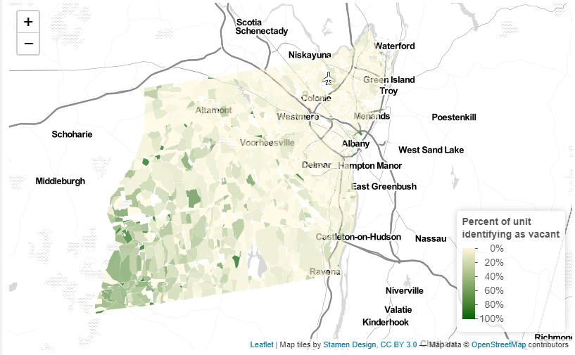

```{r setup, include=FALSE}
knitr::opts_chunk$set(echo = TRUE)
```

Hello my name is Le. I am an architect and urban designer that currently having master's degree study at Harvard GSD. This is my portfolio of Spatial Analysis class that demonstrate my skills of RStudio.

This portfolio demonstrate each of the following skills (not all of which are demonstrated in this example):

* Displaying multiple vector layers on the same map
* Calculating and displaying relationships among point and polygon layers based on distance
* Aggregating point data to a layer of polygons
* Calculating and displaying accessibility, based on travel time
* Converting between raster layers and vector layers
* Displaying raster data on a map
* Georeferencing a raster image
* Displaying data on an interactive map

# Bike Station Maps of Cambridge, MA
The following set of maps show the bike station amount by neighborhood in Cambridge, MA of USA.
It shows the following skills:

* Aggregating point data to a layer of polygons

[(https://lyanggsd.github.io/Le-Yang_Portfolio/fullsize/Bikecam.pdf)]{target="_blank"}

# Old Tokyo Map Overlay with Today's Transportation System
This map demonstrates the following skills:

* Georeferencing a raster image

[(https://lyanggsd.github.io/Le-Yang_Portfolio/fullsize/Tokyo%20Georeference%202%20-%20Bus%20Routes%20and%20Bike%20Lanes.pdf)]{target="_blank"}

# Maps of Los Angeles, CA
Here are two maps of Los Angeles, California. They show the relationship between bus stops and the farmers market, indicating the accessibility of local farmer's market by bus transit

## Isochrones
This map shows isochrones based on transit travel times to the nearest school. It demonstrates the following skills:

* Displaying multiple vector layers on the same map
* Calculating and displaying accessibility, based on travel time

[(https://lyanggsd.github.io/Le-Yang_Portfolio/fullsize/bus_fmmkt_Isochrone.pdf)]{target="_blank"}

## Accessibility
This map shows accessibility based on a distance-decay function of the walking time to the nearest bus stop. It demonstrates the following skills:

* Displaying multiple vector layers on the same map
* Calculating and displaying accessibility, based on travel time
* Displaying raster data on a map

[(https://lyanggsd.github.io/Le-Yang_Portfolio/fullsize/pedtobus.pdf)]{target="_blank"}

# Maps of Troy, NY
The following map is an interactive map that need to be click on in order to forward to a separate page. It maps the vacancy property of Troy, NY

* Displaying data on an interactive map

[](https://lyanggsd.github.io/Le-Yang_Portfolio/fullsize/tory_vacancy.html){target="_blank"}